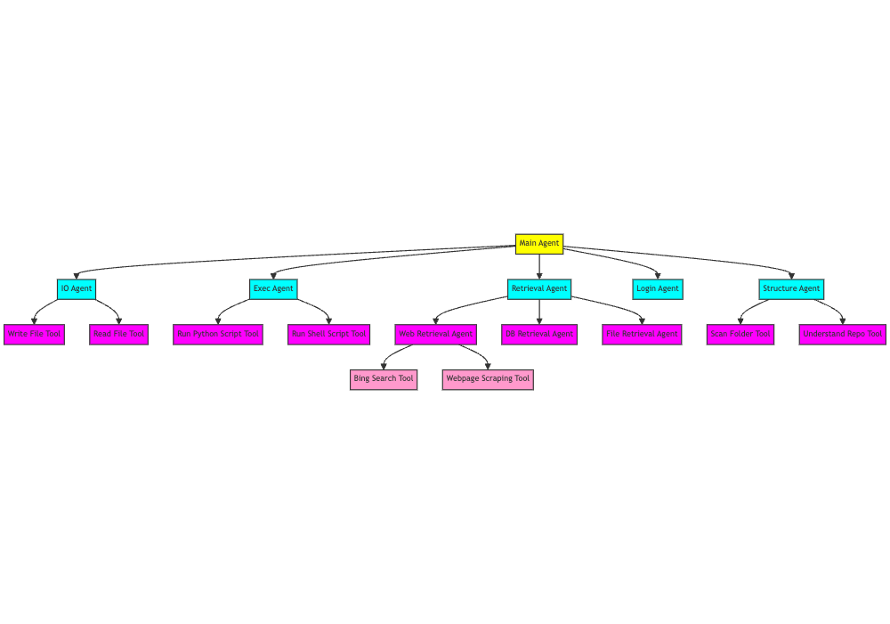

# LiteMultiAgent
Please note that the LiteMultiAgent repository is in development mode. We have open-sourced the repository to foster collaboration between contributors.

repo owner: Danni (Danqing) Zhang (danqing.zhang.personal@gmail.com)

main contributors: Balaji Rama (balajirw10@gmail.com), Shiying He (sy.he0303@gmail.com) and Jingyi Ni (jingyi.ni.personal@gmail.com)

<a href='https://danqingz.github.io/blog/2024/07/27/LiteMultiAgent.html'></a>
<a href='https://litemultiagent.readthedocs.io/en/latest/'></a>

In our exploration of building multi-agent systems, we have investigated AutoGen, CrewAI, LangGraph, and MetaGPT, but failed to find a multi-agent system that intuitively makes multi-agent systems more efficient. We have found that most examples provided by these frameworks could be accomplished with just one agent. We reimplemented the multi-agent examples using only one agent with a set of self-defined tools. However, we then realized that this system is not scalable when we have more and more tools. But if we can categorize the agents with different sets of tools into categories, then we are building a hierarchy of agents, where we could accomplish more types of tasks. At the same time, because of this design, the execution of sub-agents is naturally parallelized by parallel function calling, since agents use sub-agents as tools.


## ✈️ 1. Getting Started

### (1) Installation
From PyPI: https://pypi.org/project/litemultiagent/
```
pip install litemultiagent 
```

Set up locally
First set up virtual environment, and allow your code to be able to see 'litemultiagent'
```bash
python3 -m venv venv
. venv/bin/activate
pip install -e .
```
Then set up a Supabase project to retrieve the API keys, and create a table if you want to save the results to a Supabase table. Please add the below columns to your Supabase table, and disable RLS.

| Column Name     | Data Type     |
|-----------------|---------------|
| agent           | text          |
| depth           | int8          |
| response        | text          |
| role            | text          |
| prompt_tokens   | int8          |
| completion_tokens | int8        |
| input_cost      | float8        |
| output_cost     | float8        |
| total_cost      | float8        |
| model_name      | text          |
| meta_task_id    | text          |
| task_id         | int8          |

Then please create a .env file, and update your API keys:

```bash
cp .env.example .env
```

### (2) Quickstart
After configuring your API keys, you can run main.py, where the sub-agents are already parallelized through parallel function calling.
```bash
python litemultiagent/main.py
```
TODO: add parallel function calling

## 🏠 2. Architecture Design



## 🚀 3. Contributions
For how to contribute, see [CONTRIBUTE](https://github.com/PathOnAI/LiteMultiAgent/blob/main/CONTRIBUTE.md). If you would like to contribute to the codebase, [issues](https://github.com/PathOnAI/LiteMultiAgent/issues) or [pull requests](https://github.com/PathOnAI/LiteMultiAgent/pulls) are always welcome!

## 📄 4. Citing LiteMultiAgent
```
@misc{zhang2024litemultiagent,
  title={LiteMultiAgent},
  author={Zhang, Danqing and Rama, Balaji and He, Shiying and Ni, Jingyi},
  journal={https://danqingz.github.io/blog/2024/07/27/LiteMultiAgent.html},
  year={2024}
}
```